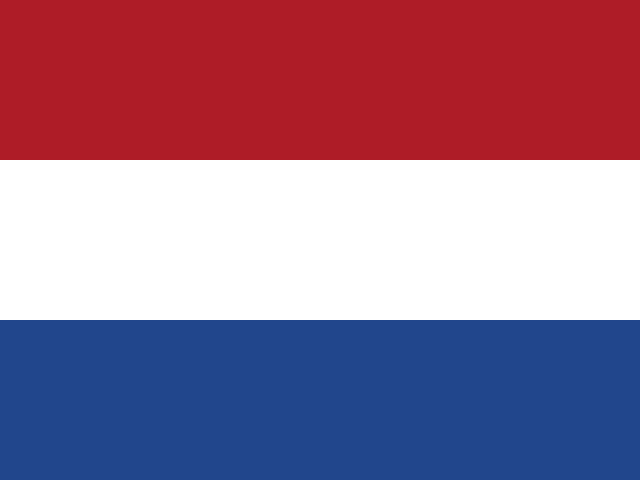
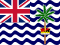
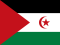

# Flags
This set currently includes the 259 flags below:

|                             Flag                              |  Code  | Region                                 |
|:-------------------------------------------------------------:|:------:|----------------------------------------|
|      |   AD   | Andorra                                |
|      |   AE   | United Arab Emirates                   |
|      |   AF   | Afghanistan                            |
|      |   AG   | Antigua & Barbuda                      |
|      |   AI   | Anguilla                               |
|      |   AL   | Albania                                |
|      |   AM   | Armenia                                |
|      |   AO   | Angola                                 |
|      |   AQ   | Antarctica                             |
|      |   AR   | Argentina                              |
|      |   AS   | American Samoa                         |
|      |   AT   | Austria                                |
|      |   AU   | Australia                              |
|      |   AW   | Aruba                                  |
|      |   AX   | Åland Islands                          |
|      |   AZ   | Azerbaijan                             |
|      |   BA   | Bosnia & Herzegovina                   |
|      |   BB   | Barbados                               |
|      |   BD   | Bangladesh                             |
|      |   BE   | Belgium                                |
|      |   BF   | Burkina Faso                           |
|      |   BG   | Bulgaria                               |
|      |   BH   | Bahrain                                |
|      |   BI   | Burundi                                |
|      |   BJ   | Benin                                  |
|      |   BL   | St. Barthélemy                         |
|      |   BM   | Bermuda                                |
|      |   BN   | Brunei                                 |
|      |   BO   | Bolivia                                |
|      |   BQ   | Caribbean Netherlands                  |
|      |   BR   | Brazil                                 |
|      |   BS   | Bahamas                                |
|      |   BT   | Bhutan                                 |
|      |   BV   | Bouvet Island                          |
|      |   BW   | Botswana                               |
|      |   BY   | Belarus                                |
|      |   BZ   | Belize                                 |
|      |   CA   | Canada                                 |
|      |   CC   | Cocos (Keeling) Islands                |
|      |   CD   | Congo - Kinshasa                       |
|      |   CF   | Central African Republic               |
|      |   CG   | Congo - Brazzaville                    |
|      |   CH   | Switzerland                            |
|      |   CI   | Côte d’Ivoire                          |
|      |   CK   | Cook Islands                           |
|      |   CL   | Chile                                  |
|      |   CM   | Cameroon                               |
|      |   CN   | China                                  |
|      |   CO   | Colombia                               |
|      |   CR   | Costa Rica                             |
|      |   CU   | Cuba                                   |
|      |   CV   | Cape Verde                             |
|      |   CW   | Curaçao                                |
|      |   CX   | Christmas Island                       |
|      |   CY   | Cyprus                                 |
|      |   CZ   | Czechia                                |
|      |   DE   | Germany                                |
|      |   DG   | Diego Garcia                           |
|      |   DJ   | Djibouti                               |
|      |   DK   | Denmark                                |
|      |   DM   | Dominica                               |
|      |   DO   | Dominican Republic                     |
|      |   DZ   | Algeria                                |
|      |   EC   | Ecuador                                |
|      |   EE   | Estonia                                |
|      |   EG   | Egypt                                  |
|      |   EH   | Western Sahara                         |
|      |   ER   | Eritrea                                |
|      |   ES   | Spain                                  |
|      |   ET   | Ethiopia                               |
|      |   EU   | European Union                         |
|      |   FI   | Finland                                |
|      |   FJ   | Fiji                                   |
|      |   FK   | Falkland Islands (Islas Malvinas)      |
|      |   FM   | Micronesia                             |
|      |   FO   | Faroe Islands                          |
|      |   FR   | France                                 |
|      |   GA   | Gabon                                  |
|      |   GB   | United Kingdom                         |
|  | GB_ENG | England                                |
|  | GB_NIR | Northern Ireland                       |
|  | GB_SCT | Scotland                               |
|  | GB_WLS | Wales                                  |
|  | GB_ZET | Shetland                               |
|      |   GD   | Grenada                                |
|      |   GE   | Georgia                                |
|      |   GF   | French Guiana                          |
|      |   GG   | Guernsey                               |
|      |   GH   | Ghana                                  |
|      |   GI   | Gibraltar                              |
|      |   GL   | Greenland                              |
|      |   GM   | Gambia                                 |
|      |   GN   | Guinea                                 |
|      |   GP   | Guadeloupe                             |
|      |   GQ   | Equatorial Guinea                      |
|      |   GR   | Greece                                 |
|      |   GS   | South Georgia & South Sandwich Islands |
|      |   GT   | Guatemala                              |
|      |   GU   | Guam                                   |
|      |   GW   | Guinea-Bissau                          |
|      |   GY   | Guyana                                 |
|      |   HK   | Hong Kong                              |
|      |   HM   | Heard & McDonald Islands               |
|      |   HN   | Honduras                               |
|      |   HR   | Croatia                                |
|      |   HT   | Haiti                                  |
|      |   HU   | Hungary                                |
|      |   IC   | Canary Islands                         |
|      |   ID   | Indonesia                              |
|      |   IE   | Ireland                                |
|      |   IL   | Israel                                 |
|      |   IM   | Isle of Man                            |
|      |   IN   | India                                  |
|      |   IO   | British Indian Ocean Territory         |
|      |   IQ   | Iraq                                   |
|      |   IR   | Iran                                   |
|      |   IS   | Iceland                                |
|      |   IT   | Italy                                  |
|      |   JE   | Jersey                                 |
|      |   JM   | Jamaica                                |
|      |   JO   | Jordan                                 |
|      |   JP   | Japan                                  |
|      |   KE   | Kenya                                  |
|      |   KG   | Kyrgyzstan                             |
|      |   KH   | Cambodia                               |
|      |   KI   | Kiribati                               |
|      |   KM   | Comoros                                |
|      |   KN   | St. Kitts & Nevis                      |
|      |   KP   | North Korea                            |
|      |   KR   | South Korea                            |
|      |   KW   | Kuwait                                 |
|      |   KY   | Cayman Islands                         |
|      |   KZ   | Kazakhstan                             |
|      |   LA   | Laos                                   |
|      |   LB   | Lebanon                                |
|      |   LC   | St. Lucia                              |
|      |   LI   | Liechtenstein                          |
|      |   LK   | Sri Lanka                              |
|      |   LR   | Liberia                                |
|      |   LS   | Lesotho                                |
|      |   LT   | Lithuania                              |
|      |   LU   | Luxembourg                             |
|      |   LV   | Latvia                                 |
|      |   LY   | Libya                                  |
|      |   MA   | Morocco                                |
|      |   MC   | Monaco                                 |
|      |   MD   | Moldova                                |
|      |   ME   | Montenegro                             |
|      |   MF   | St. Martin                             |
|      |   MG   | Madagascar                             |
|      |   MH   | Marshall Islands                       |
|      |   MK   | North Macedonia                        |
|      |   ML   | Mali                                   |
|      |   MM   | Myanmar (Burma)                        |
|      |   MN   | Mongolia                               |
|      |   MO   | Macao                                  |
|      |   MP   | Northern Mariana Islands               |
|      |   MQ   | Martinique                             |
|      |   MR   | Mauritania                             |
|      |   MS   | Montserrat                             |
|      |   MT   | Malta                                  |
|      |   MU   | Mauritius                              |
|      |   MV   | Maldives                               |
|      |   MW   | Malawi                                 |
|      |   MX   | Mexico                                 |
|      |   MY   | Malaysia                               |
|      |   MZ   | Mozambique                             |
|      |   NA   | Namibia                                |
|      |   NC   | New Caledonia                          |
|      |   NE   | Niger                                  |
|      |   NF   | Norfolk Island                         |
|      |   NG   | Nigeria                                |
|      |   NI   | Nicaragua                              |
|      |   NL   | Netherlands                            |
|      |   NO   | Norway                                 |
|      |   NP   | Nepal                                  |
|      |   NR   | Nauru                                  |
|      |   NU   | Niue                                   |
|      |   NZ   | New Zealand                            |
|      |   OM   | Oman                                   |
|      |   PA   | Panama                                 |
|      |   PE   | Peru                                   |
|      |   PF   | French Polynesia                       |
|      |   PG   | Papua New Guinea                       |
|      |   PH   | Philippines                            |
|      |   PK   | Pakistan                               |
|      |   PL   | Poland                                 |
|      |   PM   | St. Pierre & Miquelon                  |
|      |   PN   | Pitcairn Islands                       |
|      |   PR   | Puerto Rico                            |
|      |   PS   | Palestine                              |
|      |   PT   | Portugal                               |
|      |   PW   | Palau                                  |
|      |   PY   | Paraguay                               |
|      |   QA   | Qatar                                  |
|      |   RE   | Réunion                                |
|      |   RO   | Romania                                |
|      |   RS   | Serbia                                 |
|      |   RU   | Russia                                 |
|      |   RW   | Rwanda                                 |
|      |   SA   | Saudi Arabia                           |
|      |   SB   | Solomon Islands                        |
|      |   SC   | Seychelles                             |
|      |   SD   | Sudan                                  |
|      |   SE   | Sweden                                 |
|      |   SG   | Singapore                              |
|      |   SH   | St. Helena                             |
|      |   SI   | Slovenia                               |
|      |   SJ   | Svalbard & Jan Mayen                   |
|      |   SK   | Slovakia                               |
|      |   SL   | Sierra Leone                           |
|      |   SM   | San Marino                             |
|      |   SN   | Senegal                                |
|      |   SO   | Somalia                                |
|      |   SR   | Suriname                               |
|      |   SS   | South Sudan                            |
|      |   ST   | São Tomé & Príncipe                    |
|      |   SV   | El Salvador                            |
|      |   SX   | Sint Maarten                           |
|      |   SY   | Syria                                  |
|      |   SZ   | Eswatini                               |
|      |   TC   | Turks & Caicos Islands                 |
|      |   TD   | Chad                                   |
|      |   TF   | French Southern Territories            |
|      |   TG   | Togo                                   |
|      |   TH   | Thailand                               |
|      |   TJ   | Tajikistan                             |
|      |   TK   | Tokelau                                |
|      |   TL   | Timor-Leste                            |
|      |   TM   | Turkmenistan                           |
|      |   TN   | Tunisia                                |
|      |   TO   | Tonga                                  |
|      |   TR   | Türkiye                                |
|      |   TT   | Trinidad & Tobago                      |
|      |   TV   | Tuvalu                                 |
|      |   TW   | Taiwan                                 |
|      |   TZ   | Tanzania                               |
|      |   UA   | Ukraine                                |
|      |   UG   | Uganda                                 |
|      |   UM   | U.S. Outlying Islands                  |
|      |   US   | United States                          |
|   | US_CA  | California                             |
|      |   UY   | Uruguay                                |
|      |   UZ   | Uzbekistan                             |
|      |   VA   | Vatican City                           |
|      |   VC   | St. Vincent & Grenadines               |
|      |   VE   | Venezuela                              |
|      |   VG   | British Virgin Islands                 |
|      |   VI   | U.S. Virgin Islands                    |
|      |   VN   | Vietnam                                |
|      |   VU   | Vanuatu                                |
|      |   WF   | Wallis & Futuna                        |
|      |   WS   | Samoa                                  |
|      |   XK   | Kosovo                                 |
|      |   YE   | Yemen                                  |
|      |   YT   | Mayotte                                |
|      |   ZA   | South Africa                           |
|      |   ZM   | Zambia                                 |
|      |   ZW   | Zimbabwe                               |
